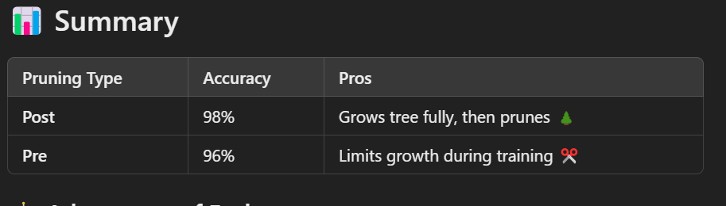

# ML-Practice-Playground

## Decision Tree Classifier with Pre-Pruning & Post-Pruning

This project showcases a Decision Tree Classifier using the Iris dataset , implementing Pre-Pruning and Post-Pruning techniques to improve model performance and prevent overfitting. The classifier is built in Python, leveraging scikit-learn for model building, tuning, and evaluation.

### 📂 Project Files
classifier.py - Main code file containing model setup, training, and evaluation.
README.md - This file with documentation.
requirements.txt - List of required Python packages.
### 📚 Overview
The Iris dataset is used to train and evaluate the model, which is split into training and testing sets in a 70-30 split (random state = 42). The objective is to classify flowers into three categories: Setosa, Versicolor, and Virginica based on features like 🌱 sepal length, sepal width, petal length, and petal width.

### Training the Model
#### Post-Pruning
Post-pruning involves growing the tree fully and then trimming it back to control complexity.

####  Pre-Pruning
Pre-pruning restricts the tree's growth during training by limiting parameters like max_depth and criterion.

Post-Pruning: Allows the tree to grow entirely before reducing complexity, often yielding high accuracy.
Pre-Pruning: Controls tree growth from the start, reducing overfitting risks early.